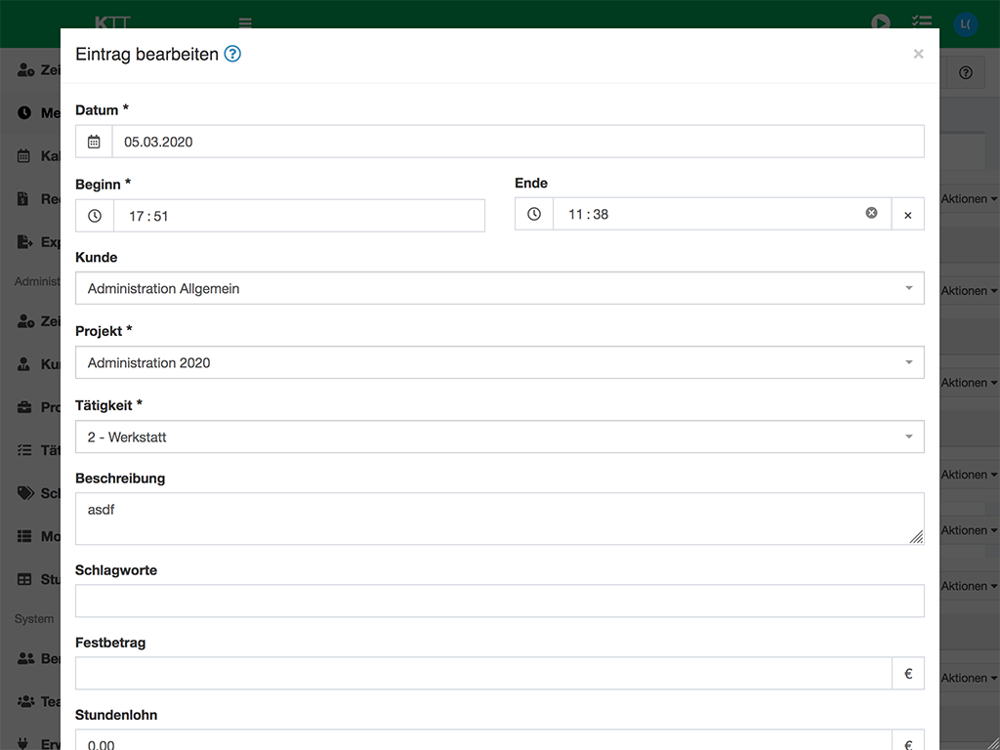

# CustomTimesheetFormBundle

A Kimai 2 plugin, to use a custom built form for timesheet entries.

## Description/Contents

This Plugin overwrites the default Routes for the timesheet-(admin-)form. 
The `Begin` is splitted into `begindate` and `begintime` and the `end`is only displayed as a time field (the enddate 
is automatically) selected by the startdate and increased by `+1day` when the endtime is before the starttime - so no 
entries with a duration longer than 23:59 are possible. This is also used to prevent wrong date-selections of the endtime.  

> **Note:** JS-Actions with information on this feature is not yet working properly in the timesheet-form. 

This Plugin is designed to improve the use of Kimai2 for users with small screens (smartphones) which results
in the following additional ** Contents:**

+ Detecting the device-width (screen-with) by using JS to check which bootstrap-`div` is visible. 
  See [Resources/public/js/visible-media-query.js](https://github.com/lduer/CustomTimesheetFormBundle/blob/master/Resources/public/js/visible-media-query.js)
+ Add a Timepicker to help selecting the right time. On narrow (mobile) screens, this is currently disabled, 
  because I haven't found a suitable JS-Timepicker but at least the native timepicker on android is not that bad. 
+ Disabling Select2 Boxes on small screens. Most of the mobile browsers shows a better list and while filling the 
  search field, the select-list is modified, browsers are doing weird stuff (jumping up and down, no display of 
  select-list, you need to hide the keyboard to see the list again, only 3-4 entries displayed, you need to scroll up/down )   

## Screenshot



## Installation

First clone it to your Kimai installation `plugins` directory:
```
cd /kimai/var/plugins/
git clone https://gitlab.com/lduer/CustomTimesheetFormBundle.git
```

Install the assets (a JS file is loaded via `src`)
```
cd /kimai/
$ bin/console assets:install --symlink
``` 

And then rebuild the cache: 
```
bin/console cache:clear
bin/console cache:warmup
```


## TODO

- make the time-interval (minutes) configuratble, as suggested in https://github.com/kevinpapst/kimai2/issues/1171
-- or read from rounding (default used method)